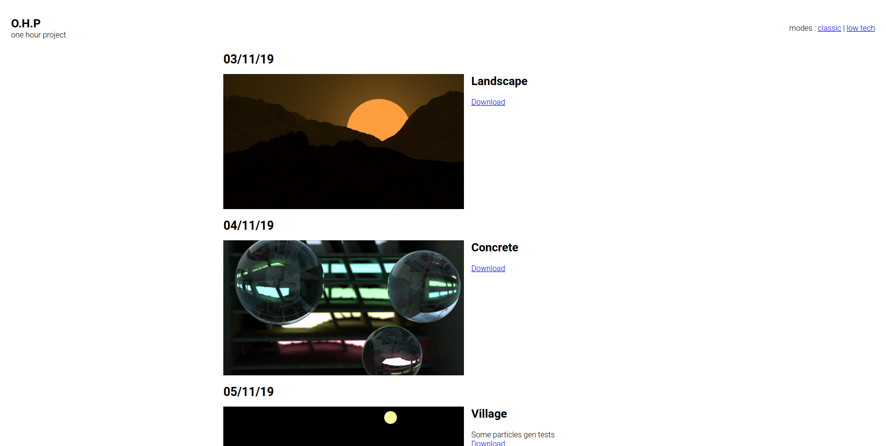

# builder

A simple satic page builder builder for the onehourproject website
it serve a specific purpose, sharing the renders of my projects and a download link to the source files



# Requirements
Python 2
libjpeg-dev
Pillow


# Quick Start
- Create a folder with the name of your category 
  - Inside the folder :
    - create a new folder representing your article
    - Inside the article folder :
      - add an image for your article 
      - add a markdown file

You should now have this type of structure :
- myCategoryFolder :
  - myarticleFolder :
    - myArticleImage.jpg
    - myArticleText.md

**About the images :**
Accepted extensions : png/jpg/jpeg
Image will be compressed with the same aspect ration to a 500px witdh size

## Setting up the markdown file :
Your markdown file should look like this
```markdown

# My Beautifull title

## DD/MM/YY

Beautifull text description :D

[Download](http://mydownloadlink)
```
## Setting up the config file
Copy the example.config.json and rename it to config.json

**Root Path :**
Change the path section to the path where you have your folder structure root
(in this example it would be : "../myCategoryFolder)
**Category path :**
Here you will tell the the builder which category should be taken into account
Ex :
``` json
     "categories" : [["../sctructureRoot/myCategoryFolder", "typeOfCategory"]]
```

For informations about the types of category go to types section

The config file is used to indicate the path to your folder structure 
The **lowTech** and **exclusion** entries do not work for now 


## RUN !!
Once everything is setup you just have to launch the builder.py file
> python builder.py

After the script is finished you will find a new folder named public containing your static website generated


# The Types
The types of category is used when your project doesnt have an image render form the goal is to replace every image of this category by a generic image describing the category (for example an image with a music not on it for the Music category)

**Setup types :**
The types can be declared in the layout/types folder juste create a image with the name of your type and declare them in the config.json categories entry

# Templating

**main.html :**
The main file is the general design, you will find the css/js import inside this folder, the **{{articles}}** will import the article.html file

**article.html :**
The article file is the html design of each article here are the templating inputs you can use :
- {{date}}
- {{media}}
- {{title}}
- {{body}}
- {{link}}

Write your article template according to thoses values.


### What is outputed ?
#### Structure :
- public
    - index.html
    - classic
        - index.html
        - ca1.html
        - cat2.html
        - medias
            - DD-MM-YY
                - cat.title.jpg (ex : 3d.villages)
    - lowtech
        - index.html
        - ca1.html
        - cat2.html
        - medias
            - DD-MM-YY
                - cat.title.jpg (ex : 3d.villages)


### Templating structure
- main.html
- article.html
- style.css
